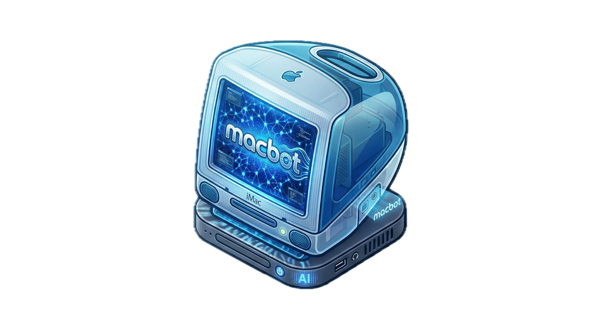

<p align="center">
  
</p>

# macbot

Native macOS AI assistant — private, on-device, always aware.


Built with SwiftUI and Metal. Runs models locally via [Ollama](https://ollama.com). Multi-agent orchestration, ambient context, desktop companion, and OS automation — things cloud AI can't do.

## Install

```bash
# 1. Install Ollama
brew install ollama
ollama serve &

# 2. Pull the base models (macbot auto-detects your hardware and
#    recommends the right size on first launch)
ollama pull qwen3.5:9b              # main model (18GB+ Macs)
ollama pull qwen3-embedding:0.6b    # required for semantic search

# 3. Build and run
git clone https://github.com/matthewbmerino/macbot
cd macbot
./bundle.sh
open macbot.app
```

macbot detects your Mac's chip and RAM on first launch and selects the best model tier automatically — from `qwen3.5:4b` on 8GB Macs up to `gemma4:27b` on 64GB+ machines. See the [model table](#models) below.

Grant **Accessibility** and **Screen Recording** in System Settings > Privacy & Security when prompted. Permissions persist across launches.

```bash
# Install to Applications (optional)
cp -R macbot.app /Applications/
```

## What it does

macbot is a local AI that lives on your Mac. It sees what you're doing, controls apps for you, and learns from your patterns — without sending anything to the cloud.

### Desktop Companion
A floating orb rendered with a Metal shader that breathes, changes color with mood, and leans toward your cursor. Click it to chat. It watches what app you're in, what you've copied, and offers help proactively.

```
/companion          toggle the orb on/off
```

### Director Mode
Watch macbot work step by step. A cinematic split-panel window shows the streaming response on the left and a live timeline of every tool call on the right. You can interrupt mid-stream to redirect.

```
/director <task>    open Director with a task
```

### Transparent Overlay
Dim your screen, select any region, and ask about it. macbot captures the screen and answers questions about what it sees.

```
/overlay            activate (also Cmd+Shift+O)
```

### Ghost Cursor
macbot takes over your Mac. A translucent animated cursor moves across the screen, opening apps, clicking buttons, typing text — while a narration panel explains each step. Uses Accessibility API and CGEvent injection.

```
/ghost <task>       e.g. /ghost open Safari and search for Swift concurrency
```

### Chat
Standard conversational AI with five specialized agents (General, Coder, Reasoner, Vision, RAG), 50+ tools, grounded responses with citation checking, and streaming at <1s first-token latency.

## Commands

| Command | What it does |
|---|---|
| `/director <task>` | Watch macbot work step by step |
| `/overlay` | Screen overlay — select and ask (Cmd+Shift+O) |
| `/companion` | Toggle desktop companion orb |
| `/ghost <task>` | OS automation with animated cursor |
| `/perf` | Performance stats — memory, traces, model |
| `/code <msg>` | Force coding agent |
| `/think <msg>` | Force reasoning agent |
| `/see <msg>` | Force vision agent |
| `/plan <task>` | Step-by-step planning mode |
| `/remember <text>` | Save to persistent memory |
| `/clear` | Summarize conversation + reset |
| `/help` | Full command list |

**Keyboard shortcuts:** Cmd+Shift+O (overlay), Cmd+Shift+D (director), Cmd+Shift+K (companion)

## Models

Defaults tuned for M3 Pro 18GB. One shared 9B model for all text agents (specialization via prompts, not separate weights). Resting footprint ~1.6GB, active ~8GB.

| Role | Model | Why |
|---|---|---|
| General / Coder / Reasoner / RAG | `qwen3.5:9b` | Best tool-calling at this size. Shared weights save ~9GB. |
| Vision | `gemma4:e4b` | Native multimodal with vision + audio. |
| Router | `qwen3.5:0.8b` | Lightweight classification, always warm. |
| Embedding | `qwen3-embedding:0.6b` | Semantic search, routing centroids. |

For other hardware:

| RAM | Suggested model |
|---|---|
| 16 GB | `qwen3.5:7b` with 8k context |
| 18 GB | `qwen3.5:9b` (default) |
| 32 GB | `qwen3.5:14b` or `gemma4:12b` |
| 64 GB+ | `gemma4:26b` (MoE, 256k context) |

## How it works

- **Agents** — five agents share one model. An embedding router classifies messages in ~50ms. Each agent has its own system prompt, tool filter, and ReAct reflection loop.
- **Learning** — every turn is traced. A k-NN router learns which tools you use for which queries and biases future routing toward your patterns.
- **Memory** — persistent vector-indexed key/value store, episodic conversation summaries, and a RAG pipeline for ingested documents.
- **Grounding** — citation guard checks numeric claims against tool outputs. The model can't fabricate stock prices or weather data.
- **Ambient awareness** — cursor position, frontmost app, window title, clipboard, battery, memory — updated live and injected into every prompt.

See [ARCHITECTURE.md](ARCHITECTURE.md) for the full technical breakdown.

## Requirements

- macOS 15+
- Apple Silicon
- [Ollama](https://ollama.com) installed and running

## Development

```bash
swift build          # debug build
swift test           # 265 tests
./bundle.sh          # release build + .app bundle
open macbot.app      # run
```

## License

[MIT](LICENSE)
