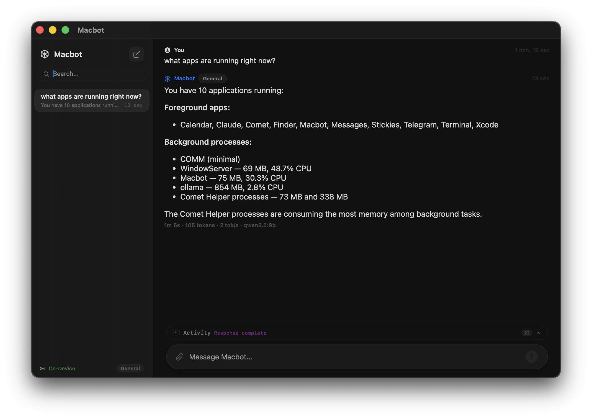
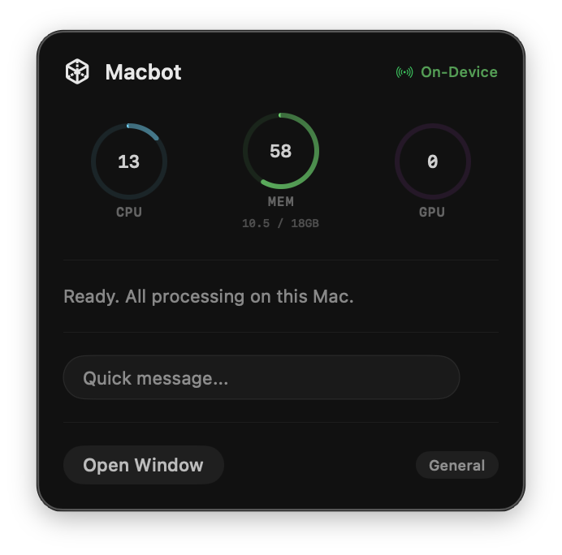

# Macbot

[](https://github.com/matthewbmerino/macbot-swift/actions/workflows/build.yml)

Native macOS AI agent — privacy-first, all processing on-device.



<p align="center">
  
</p>

Built with SwiftUI. Runs models locally via Ollama (llama.cpp Metal backend) for maximum performance. Multi-agent orchestration, semantic memory, RAG pipeline, and deep system introspection.

## Quick Start

```bash
brew install ollama
ollama serve &
ollama pull qwen3.5:9b
ollama pull qwen3-embedding:0.6b
ollama pull gemma4:e4b   # vision; optional

git clone https://github.com/matthewbmerino/macbot-swift
cd macbot-swift
swift build
swift run Macbot
```

First launch walks you through model selection and grants the macOS
permissions Macbot needs (Accessibility, Screen Recording for OCR, Calendar
and Contacts for those tools). Everything runs locally — nothing leaves the
machine.

## Configuration

Macbot ships with defaults tuned for an **M3 Pro 18GB**: a single shared 9B
model for general/coder/reasoner/RAG (specialization via system prompts), a
small multimodal vision model, and a tiny router + embedding model that stay
warm. Resting footprint ~1.6 GB, active ~8 GB.

If you're on different hardware, swap the assignments via the in-app
Onboarding/Settings flow (which writes `ModelConfig` to UserDefaults). Rough
guidance:

| RAM | Suggested general model | Suggested vision | Notes |
|---|---|---|---|
| 16 GB | `qwen3.5:7b` | `gemma4:e4b` | Drop `num_ctx` to 8k to stay clear of swap. |
| 18 GB (M3 Pro) | `qwen3.5:9b` *(default)* | `gemma4:e4b` | Default config. |
| 32 GB | `qwen3.5:14b` or `gemma4:12b` | `gemma4:12b` | Comfortable headroom; can hold two warm models. |
| 64 GB+ | `gemma4:26b` (MoE, 4B active) | `gemma4:26b` | 256k ctx, multimodal, runs fast for an MoE. |

`ModelConfig` includes a one-time migration that rewrites known oversized
choices from earlier versions of the project (`deepseek-r1:14b`,
`qwen2.5:32b`, `qwen3-vl:8b`) to the current 18 GB defaults so an upgrade
doesn't surprise you.

`keep_alive` is set to `5m` so models actually unload between sessions —
holding multiple 9B models warm on 18 GB causes swap thrashing.

## Architecture

<details>
<summary>ASCII diagram</summary>

```
   ┌────────────────────┐         ┌──────────────────────┐
   │   AmbientMonitor   │ ──────► │   User Message       │
   │  active app, idle, │         │ + transient ambient  │
   │  battery, clipbd   │         │   context line       │
   └────────────────────┘         └──────────┬───────────┘
                                             │
                                  ┌──────────▼───────────┐
                                  │  Embedding Router    │ ~50ms
                                  │  (LLM fallback)      │
                                  └──────────┬───────────┘
                                             │
            ┌──────────┬──────────┬──────────┼──────────┐
            ▼          ▼          ▼          ▼          ▼
        General     Coder    Reasoner    Vision       RAG
       qwen3.5    qwen3.5   qwen3.5   gemma4:e4b    qwen3.5
         9B         9B        9B          8B          9B
       (shared weights — specialization via system prompt)
            │          │          │          │          │
            └──────────┴────┬─────┴──────────┴──────────┘
                            │
                ┌───────────▼────────────┐
                │  Per-turn agent loop    │
                │  • inject ambient ctx   │
                │  • tool filter (50+)    │
                │  • up to 10 tool rounds │
                │  • retry + timeout      │
                │  • compression > 2K     │
                │  • self-verification    │
                │  • ReAct reflection     │
                └───────────┬─────────────┘
                            │
            ┌───────────────┼───────────────┐
            ▼               ▼               ▼
     ┌────────────┐ ┌──────────────┐ ┌─────────────┐
     │   Tools    │ │   Memory     │ │     RAG     │
     │ (50+)      │ │              │ │             │
     │            │ │ Vector store │ │ Ingest      │
     │ macOS auto │ │ (vDSP SIMD)  │ │ Chunk       │
     │ web/browse │ │ Episodes     │ │ Embed       │
     │ files/git  │ │  v6 schema   │ │ Hybrid      │
     │ code (sbx) │ │  auto-summ   │ │  search     │
     │ finance    │ │  on /clear   │ │ Re-rank     │
     │ charts     │ │ Composite    │ │             │
     │ calendar   │ │  workflows   │ └─────────────┘
     │ email      │ │              │
     │ media      │ └──────────────┘
     │ screen OCR │
     │  native SCK│        ┌──────────────────────┐
     │  + Vision  │        │  On-device image gen │
     │ image gen  │        │  MLX SDXL-Turbo      │
     │  SDXL-Turbo│        │  ~2-4s, no cloud     │
     │ ambient ctx│        └──────────────────────┘
     │ recall_eps │
     └────────────┘        ┌──────────────────────┐
                           │  Mixture of Agents   │
                           │  parallel + synth    │
                           └──────────────────────┘

              ┌──────────────────────────────────┐
              │   Response Metrics                │
              │   3.2s · 156 tok · 49/s · model  │
              └──────────────────────────────────┘
```

</details>

## Models

Default configuration tuned for an M3 Pro 18GB. Resting footprint ~1.6GB,
active ~8GB, leaving real headroom for the OS.

| Role | Model | Context | Use |
|------|-------|---------|-----|
| General | qwen3.5:9b | 16k | Conversation, planning, tools |
| Coder | qwen3.5:9b | 16k | Code generation, debugging (shared weights, coder system prompt) |
| Reasoner | qwen3.5:9b | 16k | Math, logic, escalated analysis (shared weights) |
| Vision | gemma4:e4b | 8k | Image + audio analysis, screen OCR fallback (multimodal) |
| RAG | qwen3.5:9b | 16k | Knowledge-base queries |
| Router | qwen3.5:0.8b | 4k | Classification, episode summarization |
| Embedding | qwen3-embedding:0.6b | 2k | Semantic search, routing centroids |

`coder` / `reasoner` / `rag` share weights with `general` — specialization comes
from system prompts, not different models. This keeps Ollama's resident set
small enough that the OS doesn't swap. `keep_alive` is `5m` so models actually
unload between sessions.

**Why not bigger models?** The 24B and 14B configurations from earlier versions
of this project pushed the M3 Pro into swap and made simple replies take
hundreds of seconds. ModelConfig has a one-time migration that rewrites those
oversized choices on first launch. If you upgrade to a 32GB+ Mac, swap in
`gemma4:26b` (MoE, 4B active params, 256k context, multimodal) for general.

## Features

**Inference**
- Ollama backend with llama.cpp Metal GPU acceleration — battle-tested, optimized quantized kernels
- Hardware-aware model selection based on chip, RAM, GPU cores, and memory bandwidth
- Supports all Ollama-compatible models out of the box

**Agents**
- Five specialized agents: General, Coder, Reasoner, Vision, Knowledge (RAG)
- Embedding router classifies messages in ~50ms via cosine similarity
- ReAct reflection — agents evaluate tool results before responding
- Mixture of Agents — parallel execution with synthesis for comparison queries
- Planning mode with step-by-step execution and time estimates

**Memory & Knowledge**
- Persistent vector-indexed key/value memory with semantic search (Accelerate vDSP)
- **Episodic memory** — every `/clear` auto-summarizes the conversation into a
  titled, topic-tagged episode via the router model. Searchable by keyword or
  recency through the `recall_episodes` tool.
- **Ambient context loop** — a background actor polls active app, idle time,
  battery, memory, and clipboard every 5s and injects a transient context line
  before each user turn. The model knows what you're doing without being told.
- RAG pipeline: ingest files, chunk by structure, embed, hybrid search, re-rank
- Automatic embedding backfill for existing memories

**Tools (50+)**
- **System introspection:** per-process memory/CPU, top processes, listening
  ports, detailed system info, system_dashboard
- **Web:** search (DuckDuckGo), fetch pages, browse URLs, summarize_url
- **Code:** sandboxed Python execution with auto-install, shell commands
- **Finance:** real-time stock prices, YTD/historical, market indices, dark-themed
  charts and comparison charts
- **Files:** read, write, search, list directories
- **macOS automation:** open apps, take screenshots, clipboard, notifications,
  AppleScript, focus app, volume, dark mode
- **Screen OCR:** native ScreenCaptureKit + Vision framework — no Python, no
  subprocess, permission attaches reliably to Macbot.app
- **Image generation:** on-device SDXL-Turbo via MLX, ~2-4s per image, no cloud
- **Calendar / Mail / Media:** create events, draft emails, control music
- **Network:** ping, dns_lookup, port_check, http_check
- **Git:** status, log, diff
- **Skills:** weather, calculator, unit/date conversion, define_word
- **Memory:** save, recall, search, forget, recall_episodes
- **Ambient:** ambient_context for explicit "what am I doing" queries
- **Learned workflows:** teach multi-step sequences, replay as single tools

**Privacy & Security**
- All processing local — no data leaves the machine
- Biometric authentication (Touch ID / password)
- Keychain-encrypted database
- Sandboxed code execution with restricted file system access

**UI**
- Menu bar presence with live CPU/memory/GPU monitoring
- Split-view chat with sidebar, search, chat history
- Quick panel (Cmd+Shift+Space) for rapid queries
- Response metrics under each message (time, tokens, tok/s)
- Markdown rendering, inline images, drag-drop image attachment

## Commands

```
/code <msg>                          — force coding agent
/think <msg>                         — force reasoning agent
/see <msg>                           — force vision agent
/chat <msg>                          — force general agent
/knowledge <msg>                     — force knowledge/RAG agent
/plan <task>                         — generate and execute a step-by-step plan
/upgrade  (alias /big)               — re-run last user message via reasoner agent
/ingest <path>                       — ingest file/directory into knowledge base
/remember <text>                     — save to persistent memory
/memories [category]                 — list memories
/learn <name> | <desc> | <trigger>   — create a reusable workflow
/workflows                           — list learned workflows
/backend [mlx|ollama|hybrid]         — switch inference backend
/parallel                            — toggle parallel agent execution
/moa                                 — toggle Mixture of Agents
/clear                               — record episode + reset conversation
/status                              — system and model info
```

## Requirements

- macOS 14+
- Apple Silicon or Intel
- [Ollama](https://ollama.com) installed and running

## Build & test

```bash
swift build
swift test
swift run Macbot
```

See [CONTRIBUTING.md](CONTRIBUTING.md) for the full development setup,
test guidelines, and PR expectations.
